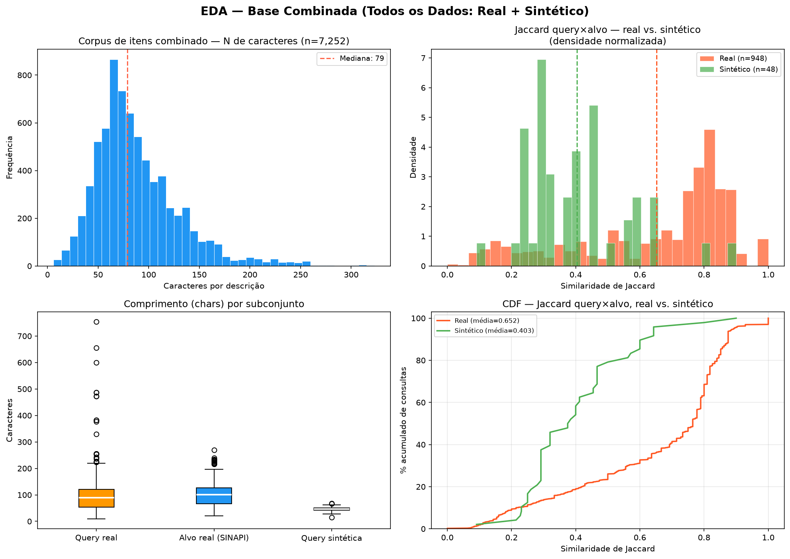
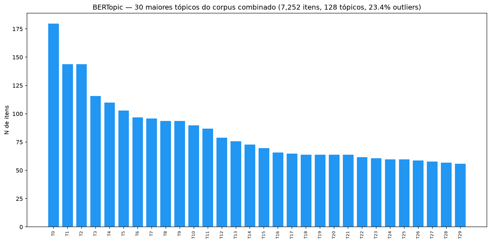
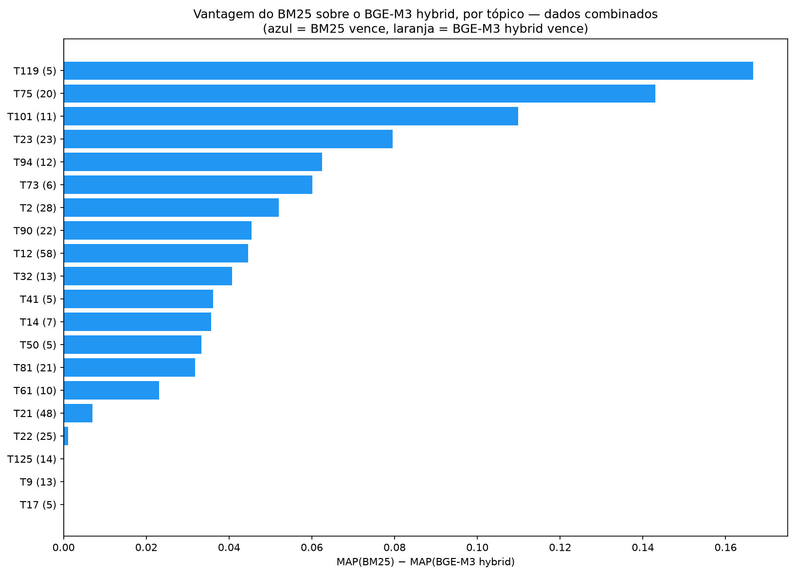
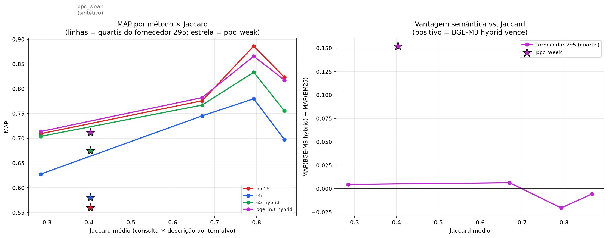
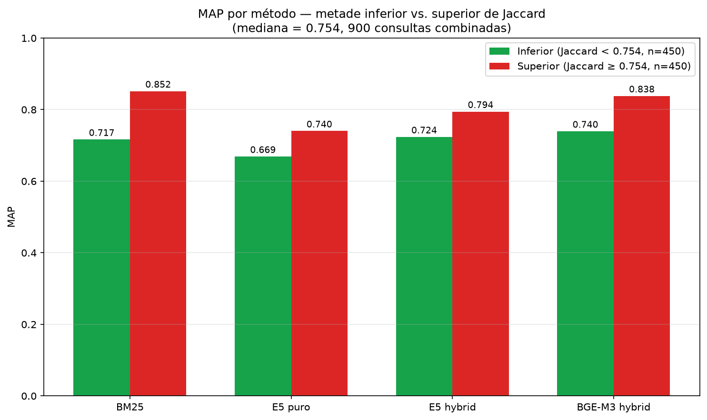
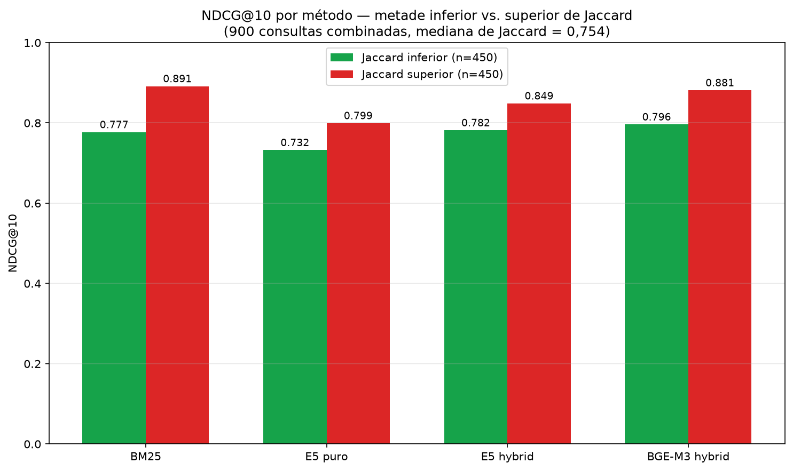

# Recuperação de Informação para Product Matching de Itens do SINAPI com Ground Truth de Produção

> **Status:** rascunho completo (versão longa) com resultados de retrieval, EDA/BERTopic, Jaccard × desempenho por quartil, base combinada (MAP ponderado) e divisão por mediana de Jaccard (Seção 4.5) preenchidos. A versão formatada para submissão (4 páginas, template SBC) em `latex/artigo_eramia_2026.tex` ainda não incorpora a Seção 4.5 — ver nota na Seção 6 do README. Pendências: rodada com BGE-M3 denso puro sobre o conjunto real, teste de significância estatística formal, revisão final do texto e da lista de referências.

## Resumo

Este trabalho avalia métodos de recuperação de informação (BM25, E5 denso, E5 hybrid e BGE-M3 hybrid) para *product matching* de itens do SINAPI, usando **dois conjuntos de dados com perfis lexicais deliberadamente distintos**: um *ground truth* real de **852 consultas**, derivadas de 948 correlações produto↔item já validadas em uso efetivo de uma plataforma de orçamentação; e um *benchmark* sintético controlado de **48 consultas** (`ppc_weak`), construído por funções de rotulagem que substituem sistematicamente a notação técnica da descrição oficial. No conjunto real, o **BM25** obtém o maior MAP (0,797), à frente do BGE-M3 hybrid (0,793), do E5 hybrid (0,764) e do E5 denso (0,712), com latência 24× menor que o BGE-M3 hybrid. No conjunto sintético, construído para ter baixa sobreposição lexical deliberada (Jaccard médio 0,403, contra 0,649 no conjunto real), o padrão se inverte: o BGE-M3 hybrid supera o BM25 em +0,152 de MAP — a maior vantagem semântica observada em todo o estudo. Essa relação, porém, é fraca dentro do próprio conjunto real (correlação de Spearman ≈ −0,07 entre Jaccard e vantagem semântica por consulta), indicando que baixa sobreposição lexical é condição necessária, mas não suficiente, para a vantagem de um *retriever* denso. Unindo os dois conjuntos em uma base combinada de 900 consultas e dividindo-as pela mediana de Jaccard, a hipótese se confirma diretamente: a vantagem semântica é positiva na metade de menor Jaccard (+0,023) e negativa na de maior Jaccard (−0,013) — efeito real, ainda que modesto. O mesmo cruzamento é reproduzido pelo NDCG (@10 e @100), métrica de ranqueamento independente do MAP, reforçando que o efeito não é artefato da métrica escolhida. O achado central é que a vantagem de *retrievers* densos sobre o lexical depende do tipo de variação terminológica e não se sustenta integralmente em dados reais de produção, onde o BM25 permanece um *baseline* forte e de baixíssimo custo para *product matching* em domínios técnicos brasileiros.

## Palavras-chave

**PT:** Recuperação de informação; product matching; busca semântica; recuperação híbrida; SINAPI; construção civil.

**EN:** Information retrieval; product matching; semantic search; hybrid retrieval; SINAPI; construction industry.

## 1. Introdução

A recuperação eficiente de informações em bases técnicas é um desafio recorrente em sistemas de apoio à engenharia, compras públicas, orçamentação e gestão de materiais. No setor da construção civil, esse problema é agravado pela quantidade de itens, composições e insumos descritos em linguagem técnica, frequentemente com variações terminológicas, abreviações e múltiplas formas de representar um mesmo conceito — um problema próximo ao de *product matching* em catálogos de produtos (PEETERS; BIZER; GLAVAŠ, 2020).

No Brasil, o SINAPI (Sistema Nacional de Pesquisa de Custos e Índices da Construção Civil) é a principal base de referência de custos para obras públicas, mas a busca por itens é dificultada pela distância entre a forma como usuários descrevem produtos e a descrição oficial do catálogo.

Este trabalho avalia métodos lexicais, densos e híbridos de recuperação de informação sobre o catálogo SINAPI usando **dois conjuntos de dados com perfis lexicais deliberadamente distintos**:

1. um **ground truth real** de 852 consultas, derivadas de correlações produto-item já validadas em uso efetivo de uma plataforma de orçamentação — refletindo como usuários reais descrevem produtos, com vocabulário de fornecedor e abreviações comerciais que uma consulta gerada artificialmente não necessariamente reproduz;
2. um **benchmark sintético controlado** de 48 consultas (`ppc_weak`), construído por funções de rotulagem que substituem sistematicamente a notação técnica da descrição oficial (ex.: DN em mm → polegadas; remoção do termo "soldável"/"roscável"), produzindo baixa sobreposição lexical de forma deliberada.

Comparar os dois conjuntos permite testar a hipótese de que *retrievers* densos têm maior vantagem sobre o BM25 quanto maior a variação lexical entre consulta e documento — e verificar se essa vantagem, esperada para paráfrases semânticas controladas, se sustenta igualmente sobre vocabulário real de produção.

Este artigo **não aborda reranking** — o foco é isolar e comparar a etapa de retrieval, complementada por uma análise exploratória (EDA) do corpus.

Os objetivos específicos são: (i) construir e documentar um benchmark de retrieval a partir de correlações reais de produção; (ii) comparar BM25, E5 (denso e híbrido) e BGE-M3 (híbrido) sobre os dois conjuntos, em termos de MAP, precisão, recall e latência; (iii) caracterizar o corpus real via EDA/modelagem de tópicos; e (iv) usar a similaridade de Jaccard entre consulta e item-alvo como variável explicativa para a diferença de comportamento entre os dois conjuntos.

Código, dados e resultados agregados estão publicamente disponíveis em: <https://github.com/igordaudt/Prod_Match_Eramia_26>.

## 2. Trabalhos Relacionados e Fundamentação

### 2.1 Product Matching e Entity Matching

A tarefa de recuperação de itens técnicos a partir de descrições textuais aproxima-se de product matching (PM) e entity matching (EM) em catálogos de produtos: identificar itens equivalentes apesar de variações terminológicas, abreviações ou diferenças de granularidade, formulada como recuperação ranqueada (PEETERS; BIZER; GLAVAŠ, 2020).

### 2.2 Recuperação Lexical, Densa e Híbrida

**BM25** (ROBERTSON; ZARAGOZA, 2009) permanece competitivo com termos técnicos exatos. **E5 multilingual** (WANG et al., 2022) e **BGE-M3** (CHEN et al., 2024) representam recuperação densa via bi-encoder. A **fusão híbrida** via Reciprocal Rank Fusion (RRF) (CORMACK; CLARKE; BUETTCHER, 2009) combina ambos sem necessidade de calibração de pesos.

### 2.3 Ground Truth de Produção como Alternativa à Geração Sintética

Consultas reais rotuladas são escassas na literatura de product matching sobre catálogos técnicos nacionais. Uma fonte alternativa, pouco documentada, são correlações produto↔catálogo já validadas em produção, coletadas como subproduto do uso real de uma ferramenta de matching. Essa abordagem elimina o risco de viés de um gerador sintético de consultas (que produz variações a partir das próprias descrições-alvo) ao custo de um volume menor de exemplos e de não ter controle programático sobre quais classes de variação terminológica estão representadas — motivando, neste trabalho, o uso complementar de um segundo conjunto sintético controlado para isolar o efeito da variação lexical.

## 3. Materiais e Métodos

### 3.1 Conjunto Real

Foi utilizado o subconjunto do catálogo SINAPI identificado internamente como fornecedor `ID_Sup = 295` na base de produção da plataforma de origem dos dados — **5.813 itens únicos**, cada um com código e descrição técnica oficial (`data/sinapi-items-295.tsv`).

O *ground truth* é composto por **correlações reais** entre produtos cadastrados por usuários da plataforma (`T_Products`) e o item SINAPI correspondente (`T_Item_Bot`, `ID_Sup = 295`), já validadas em `T_correlations` como parte do uso operacional da ferramenta — não geradas nem revisadas especificamente para este experimento.

Do total de correlações exportadas para o fornecedor 295, foram selecionadas as **948 correlações** em que a descrição do produto difere literalmente da descrição do item SINAPI (`Prod_Desc ≠ Itm_Desc`) — o subconjunto relevante para avaliação de retrieval, já que pares com descrição idêntica são triviais para qualquer método lexical. Essas 948 correlações foram agrupadas por par único `(ID_Prod, Prod_Desc)`, produzindo **852 consultas**, cada uma com um ou mais `relevant_item_ids` (múltiplos itens quando o mesmo produto foi correlacionado a mais de um item do SINAPI). Pipeline de construção: `scripts/prepare_retrieval_data.py`.

Não há controle programático sobre a distribuição de classes de variação terminológica (notação, sinonímia, omissão de parâmetros) neste conjunto — sua composição reflete diretamente o comportamento real dos usuários da plataforma ao descrever produtos.

### 3.2 Conjunto Sintético Controlado (`ppc_weak`)

Para isolar o efeito da variação lexical de forma controlada, um segundo corpus de **4.851 itens** do catálogo SINAPI serve de base a um benchmark de **48 consultas sobre 16 itens**, construído por cinco funções de rotulagem (no estilo Snorkel/Panda) que substituem sistematicamente a notação técnica da descrição oficial — a mais frequente sendo a equivalência DN em milímetros ↔ polegadas (ex.: "tubo pvc dn 25 mm" → "tubo pvc 1 polegada"), além de remoção do termo "soldável"/"roscável", sinonímia curva/joelho e omissão de ângulo. O resultado são consultas com Jaccard deliberadamente baixo em relação à descrição do item-alvo.

Por usar numeração de item independente da do conjunto real (código oficial do catálogo SINAPI, e não o identificador interno `ID_Itm` do fornecedor 295), os dois conjuntos não podem ser unificados em um único benchmark de retrieval — são avaliados **separadamente, cada um sobre seu corpus nativo**, e comparados apenas no nível de métricas agregadas.

### 3.3 Pré-processamento dos Textos

Aplicado uniformemente aos dois conjuntos (`normalization.py`): remoção de acentos, minúsculas, padronização de símbolos e frações, conversão de vírgula decimal para ponto, compactação de expressões técnicas (`17 X 27`→`17x27`, `DN 50`→`dn50`), remoção de stopwords do português (preservando "para"). Sem lematização ou radicalização.

### 3.4 Configuração dos Métodos de Retrieval

Implementações locais, in-memory, sem servidor externo (`scripts/retrieval_sinapi.py`):

| Método | Modelo | Config |
|---|---|---|
| BM25 | — | k₁=1,2, b=0,75 |
| E5 (denso) | `intfloat/multilingual-e5-small`, 384-dim | prefixos `query:`/`passage:`, cosseno |
| E5 hybrid | E5 + BM25 | RRF, k=60 |
| BGE-M3 hybrid | `BAAI/bge-m3`, 1024-dim + BM25 | RRF, k=60; embeddings dos itens de cada corpus cacheados |

Hardware: CPU Intel Core i7-10610U, 4 núcleos, 16 GB RAM, sem GPU, para ambos os conjuntos, garantindo comparabilidade de latência.

> **Nota sobre BGE-M3 denso puro:** avaliado apenas no conjunto sintético controlado (Seção 4.3), onde obtém o maior MAP entre cinco métodos. A avaliação do BGE-M3 denso puro sobre o conjunto real de 852 consultas é indicada como extensão imediata (Seção 6).

### 3.5 Protocolo Experimental

Cada consulta retornou *limit* = 100 candidatos. Os quatro métodos foram avaliados nas mesmas implementações locais, em uma única rodada por conjunto, com o cache de embeddings do BGE-M3 pré-computado e validado contra cada corpus antes do início da rodada.

### 3.6 Métricas de Avaliação

**MAP** (principal), **NDCG@10/@100** (Seção 4.5), P@5/P@10, Recall@10/50/100, tempo médio de recuperação por consulta, curvas Precisão × Recall (incluindo a envoltória interpolada, `scripts/plot_interpolated_pr.py`). MAP e NDCG são calculados por consulta e macro-agregados, sendo invariantes à escala absoluta dos scores de cada método.

### 3.7 Análise Exploratória (EDA)

A EDA cobre duas frentes, com scripts em `scripts/eda_corpus.py` e `scripts/eda_bertopic.py` e saídas em `eda/`:

**(a) Caracterização lexical dos dois conjuntos.** Calculou-se a similaridade de Jaccard (interseção/união de tokens) entre consulta e descrição do item-alvo em ambos os conjuntos: **0,649** em média no conjunto real (948 correlações; mediana 0,765) contra **0,403** no conjunto sintético controlado (48 consultas) — ver Seção 4.3 para a discussão desse achado, central para explicar a inversão de hierarquia entre BM25 e os métodos densos (Seção 4.2).

**(b) Modelagem de tópicos (BERTopic).** Aplica-se ao corpus de 5.813 itens do conjunto real uma configuração de BERTopic com *embeddings* `paraphrase-multilingual-MiniLM-L12-v2`, UMAP (`n_components=5`, cosseno, `random_state=42`), HDBSCAN (`min_cluster_size=20`), pré-processamento customizado (stopwords do domínio + remoção de números puros) e vetorização c-TF-IDF com bigramas (`ngram_range=(1,2)`, `min_df=3`). Os tópicos resultantes são cruzados com: (i) a distribuição temática das 852 consultas do ground truth; e (ii) o MAP médio por método de retrieval em cada tópico, para verificar se a vantagem do BM25 (Seção 4.1) está concentrada em famílias de produto específicas ou é um efeito geral.

### 3.8 Base Combinada, MAP Ponderado e Divisão por Mediana de Jaccard

Para testar a hipótese de vantagem semântica sob variação lexical de forma mais direta que a comparação quartil-a-quartil da Seção 3.7, os dois conjuntos foram unidos em uma base combinada de texto e métricas (`scripts/build_combined_dataset.py`): o corpus de itens foi deduplicado por descrição normalizada entre os 5.813 itens reais e os 4.851 itens do corpus sintético, resultando em **7.252 itens únicos** (3.409 presentes nos dois corpora, 2.401 só no real, 1.442 só no sintético); as consultas dos dois conjuntos foram unidas em uma tabela de **996 registros** (948 correlações reais + 48 sintéticas), com esquema comum de origem, texto de consulta e texto-alvo.

A partir dessa base, dois cortes adicionais foram calculados sobre as **900 consultas no nível de avaliação de retrieval** (852 reais agrupadas + 48 sintéticas, mesma granularidade das Tabelas 1–3): (i) um **MAP combinado**, média ponderada pelo número de consultas de cada conjunto; e (ii) uma **divisão por mediana de Jaccard** — as 900 consultas ordenadas pelo Jaccard consulta×item-alvo e cortadas ao meio, formando uma metade de menor sobreposição lexical ("inferior") e uma de maior ("superior"), com MAP recalculado por método em cada metade (`scripts/merge_datasets_analysis.py`, `scripts/jaccard_median_split.py`). Adicionalmente, recalculou-se o **NDCG@10 e NDCG@100** por consulta (relevância binária, desconto logarítmico por posição, normalizado pelo DCG ideal da própria consulta) e macro-agregado por metade, como verificação independente do MAP com a mesma lógica de agregação por consulta (`scripts/jaccard_split_ndcg.py`).

## 4. Resultados

### 4.1 Retrieval — Conjunto Real (852 consultas, limit=100)

Rodada executada sobre o corpus completo de 5.813 itens, com os embeddings do BGE-M3 pré-computados e validados contra o corpus (`cache/sinapi_bge_m3/`).

**Tabela 1 — Retrieval sobre o conjunto real (852 consultas, limit=100)**

| Método | MAP | P@5 | P@10 | Recall@10 | Recall@50 | Recall@100 | Tempo (ms) |
|---|---|---|---|---|---|---|---|
| **BM25** | **0,7967** | 0,2045 | 0,1074 | 0,9726 | 0,9930 | 0,9988 | **15,9** |
| BGE-M3 hybrid | 0,7932 | **0,2035**¹ | **0,1080** | **0,9767** | **1,0000** | **1,0000** | 378,6 |
| E5 hybrid | 0,7638 | 0,1988 | 0,1073 | 0,9705 | 0,9953 | 0,9977 | 48,7 |
| E5 (denso) | 0,7116 | 0,1854 | 0,1038 | 0,9417 | 0,9894 | 0,9930 | 283,3 |

¹ P@5 do BGE-M3 hybrid (0,2035) fica ligeiramente abaixo do BM25 (0,2045); demais colunas em negrito indicam o maior valor da coluna.
Dados completos: `results/real_295/sinapi_llm_metrics.csv`, `results/real_295/sinapi_llm_retrieval_results.json`. Curvas Precisão×Recall (bruta e interpolada): `results/real_295/sinapi_llm_precision_recall*.png`.

O BM25 obtém o maior MAP (0,7967), à frente do BGE-M3 hybrid (0,7932) — diferença de apenas 0,0035 — com latência 24× menor (15,9 ms vs. 378,6 ms). O BGE-M3 hybrid é o único método a atingir Recall@50 e Recall@100 = 1,000.

### 4.2 Comparação entre os Dois Conjuntos

**Tabela 2 — MAP: conjunto sintético controlado vs. conjunto real**

| Método | MAP — sintético controlado (48 consultas) | MAP — real (852 consultas) |
|---|---|---|
| BM25 | 0,559 (pior de 5 métodos) | **0,7967** (melhor de 4 métodos) |
| E5 (denso) | 0,580 | 0,7116 |
| E5 hybrid | 0,675 | 0,7638 |
| BGE-M3 hybrid | **0,711** | 0,7932 |
| BGE-M3 (denso) | 0,723 | não avaliado nesta rodada |

A hierarquia de métodos se **inverte** entre os dois conjuntos. No sintético controlado — consultas construídas por variação de notação técnica com Jaccard deliberadamente baixo — o BM25 é o método mais fraco (MAP 0,559) e o BGE-M3 (denso ou hybrid) lidera. No conjunto real, essa ordem se inverte quase por completo: o BM25 passa a ser o método de maior MAP (0,797), e o E5 denso cai para o pior desempenho entre os quatro métodos comparáveis (0,712).

O BM25 também atinge Recall@10 (0,973) muito próximo do BGE-M3 hybrid (0,977) no conjunto real — diferença de apenas 0,4 pp — a uma fração do custo computacional.

### 4.3 EDA — Caracterização Temática (BERTopic, Conjunto Real)

A modelagem de tópicos sobre os 5.813 itens do corpus real identificou **90 tópicos**, com **27,5% de outliers** (1.597 itens). Os maiores tópicos são famílias reconhecíveis do catálogo: instalação hidráulica água fria (T0, 151 itens), rede coletora de esgoto (T1, 148), mão de obra (T3, 132), parafusos/fixadores (T4, 108), tintas (T7, 94), entre outras — tabela completa em `eda/eda_bertopic_resultados.md`.

**Distribuição temática do ground truth.** Ao mapear os 852 itens-alvo das consultas reais para seus tópicos, **31,7%** caem em um item classificado como outlier de tópico — proporção **maior** que os 27,5% de outliers no corpus geral. Ou seja, os produtos que usuários reais buscam e correlacionam ao SINAPI tendem a ser desproporcionalmente itens atípicos, pouco representados em grandes famílias temáticas, e não uma amostra aleatória do catálogo. As famílias mais representadas no ground truth são tintas (T7, 8,3% das consultas), tubos de polietileno PN (T26, 5,6%), postes de concreto armado (T50, 5,0%) e janelas (T28, 3,2%).

**MAP por tópico e método.** O cruzamento do MAP médio por tópico com o método de retrieval (tópicos com ≥ 5 consultas no ground truth; tabela completa em `eda/map_por_topico_metodo.tsv`, gráfico em `eda/map_delta_por_topico.png`) mostra que a vantagem do BM25 sobre o BGE-M3 hybrid (Seção 4.1) **não é uniforme** — está concentrada em famílias específicas:

- **BM25 vence com folga:** T43 — tampas de concreto (ΔMAP = +0,142, n=20); T17 — blocos cerâmicos vazados (+0,125, n=14); T10 — equipamentos por potência/peso em HP (+0,054, n=22); T50 — postes de concreto armado (+0,039, n=43).
- **BGE-M3 hybrid vence:** T62 — buchas de redução PVC (ΔMAP = −0,106, n=7); T35 — itens galvanizados/fibra de vidro (−0,056, n=9); T31 — cabos por tensão nominal/tripolar (−0,052, n=14); T14 — torneiras cromadas (−0,042, n=16).
- Nos tópicos de maior volume no ground truth (T7-tintas, T26-polietileno, T50-postes), o BM25 iguala ou supera levemente o BGE-M3 hybrid, o que pesa na média geral por concentrar muitas consultas.

O padrão sugere que a vantagem do BM25 é mais forte em itens cuja descrição é dominada por termos técnicos exatos e pouco variáveis (concreto, blocos cerâmicos, potência em unidades padronizadas), enquanto o BGE-M3 hybrid mantém vantagem em famílias com maior variação de forma comercial (buchas/reduções, itens galvanizados, especificações elétricas) — hipótese que fica como direção concreta para trabalho futuro, dado o número pequeno de consultas em muitos tópicos individuais (não permite conclusão estatística robusta por tópico).

### 4.4 Jaccard × Desempenho por Método

Para testar diretamente a hipótese de que a vantagem de retrievers densos cresce com a variação lexical entre consulta e documento, cruzou-se o desempenho por método com a similaridade de Jaccard nos dois conjuntos.

**Tabela 3 — Jaccard médio × MAP por método, conjunto sintético controlado vs. conjunto real (por quartil de Jaccard)**

| Conjunto | N | Jaccard médio | BM25 | E5 | E5 hybrid | BGE-M3 hybrid |
|---|---|---|---|---|---|---|
| **Sintético controlado** | 48 | **0,403** | 0,559 | 0,580 | 0,675 | **0,711** |
| Real — Q1 (menor) | 218 | 0,285 | 0,709 | 0,628 | 0,704 | 0,714 |
| Real — Q2 | 222 | 0,670 | 0,776 | 0,745 | 0,767 | 0,782 |
| Real — Q3 | 202 | 0,793 | **0,886** | 0,780 | 0,833 | 0,866 |
| Real — Q4 (maior) | 210 | 0,866 | 0,823 | 0,698 | 0,756 | 0,818 |
| Real — geral | 852 | 0,649 | 0,797 | 0,712 | 0,764 | 0,793 |

(BGE-M3 denso puro no conjunto sintético: MAP = 0,723 — o maior valor entre os cinco métodos nesse conjunto; ver limitações, Seção 5.2.)

**O ponto mais claro do estudo está no conjunto sintético controlado.** Com Jaccard médio de 0,403, o BGE-M3 hybrid supera o BM25 por **+0,152 de MAP** (0,711 vs. 0,559) — a maior vantagem semântica observada em todo o estudo, maior inclusive que qualquer quartil do conjunto real. Isso confirma diretamente a hipótese: quando a variação lexical é uma paráfrase semântica limpa e controlada (mesma grandeza física, notação diferente), o retriever denso tem vantagem clara e o BM25 sofre.

**Dentro do conjunto real, porém, o padrão é fraco e não-monótono.** A correlação de Spearman entre Jaccard e a vantagem semântica (MAP BGE-M3 hybrid − MAP BM25), calculada por consulta, é de apenas **−0,070** — praticamente nula. O quartil de menor Jaccard real (Q1, média 0,285) tem vantagem semântica de apenas +0,005, muito menor que a do conjunto sintético (+0,152), apesar de ter Jaccard médio *mais baixo*. O quartil Q3 (Jaccard 0,793) é o de maior MAP absoluto para todos os métodos, com o BM25 na liderança (0,886).

A explicação mais provável para essa aparente contradição é que **Jaccard baixo não tem a mesma causa** nos dois conjuntos. No conjunto sintético controlado, todo o Jaccard baixo vem de um único fenômeno controlado — divergência de notação em uma mesma grandeza física — exatamente o tipo de variação que um embedding treinado para captar equivalência semântica resolve bem. No conjunto real, Jaccard baixo é um efeito agregado de causas heterogêneas: abreviações de fornecedor, códigos internos, truncamentos, ou mesmo correlações imprecisas herdadas do uso real da plataforma — casos em que a divergência não é necessariamente uma paráfrase semântica "resolúvel", e onde um embedding genérico (não ajustado ao domínio) não tem garantia de sucesso.

### 4.5 MAP Combinado e Divisão por Mediana de Jaccard (Base Combinada, 900 Consultas)

**MAP combinado.** Ponderando os dois conjuntos pelo número de consultas (Tabela 4), a hierarquia observada no conjunto real isoladamente (Tabela 1) se altera: o BGE-M3 hybrid passa a superar levemente o BM25.

**Tabela 4 — MAP combinado (900 consultas = 852 reais + 48 sintéticas)**

| Método | MAP real (852) | MAP sintético (48) | MAP combinado (900) |
|---|---|---|---|
| **BGE-M3 hybrid** | 0,7932 | 0,7114 | **0,7891** |
| BM25 | 0,7967 | 0,5592 | 0,7841 |
| E5 hybrid | 0,7638 | 0,6750 | 0,7591 |
| E5 (denso) | 0,7116 | 0,5804 | 0,7046 |

A inversão ocorre porque o BM25 despenca no subconjunto sintético (−0,238 de MAP) enquanto o BGE-M3 hybrid quase não se altera (−0,082) — mesmo as 48 consultas sintéticas sendo apenas 5,3% do total combinado, sua queda acentuada para o BM25 basta para reverter a média ponderada. Esse resultado deve ser lido como sensível ao peso relativo de amostragem entre os dois perfis de consulta, não como um veredito estável independente de como os dados foram coletados.

**Divisão por mediana de Jaccard.** A Tabela 5 divide as 900 consultas em duas metades pela mediana de Jaccard (0,754).

**Tabela 5 — MAP por metade de Jaccard (900 consultas combinadas)**

| Metade | N (real+sint) | Jaccard médio | BM25 | E5 | E5 hybrid | BGE-M3 hybrid | Vantagem semântica |
|---|---|---|---|---|---|---|---|
| Inferior (Jaccard < 0,754) | 450 (404+46) | 0,447 | 0,7165 | 0,6689 | 0,7236 | 0,7396 | **+0,0230** |
| Superior (Jaccard ≥ 0,754) | 450 (448+2) | 0,825 | 0,8516 | 0,7403 | 0,7945 | 0,8382 | **−0,0134** |

A hipótese se **confirma**: a vantagem semântica (MAP BGE-M3 hybrid − MAP BM25) é positiva na metade inferior e negativa na superior. O efeito é real, porém modesto em magnitude (amplitude de 0,036) — todos os métodos melhoram em MAP absoluto na metade de maior Jaccard, mas em ritmos diferentes: o BM25 sobe +0,135, quase o dobro do BGE-M3 hybrid (+0,099), e por isso "alcança e ultrapassa" o BGE-M3 hybrid na metade superior. Um ponto de cautela: a composição das metades é desbalanceada — a metade superior é quase inteiramente formada por consultas reais (448 de 450), já que apenas 2 das 48 consultas sintéticas têm Jaccard alto o bastante para cair ali (o conjunto sintético foi construído justamente para ter Jaccard baixo). Na prática, a metade superior é quase um recorte dentro do próprio conjunto real.

**Confirmação por NDCG.** Para verificar se o padrão da Tabela 5 depende da métrica escolhida, recalculou-se o **NDCG** por consulta (relevância binária, desconto logarítmico por posição, normalizado pelo DCG ideal de cada consulta) e macro-agregou-se por método e metade — mesma lógica de agregação do MAP, isto é, calculada inteiramente dentro de cada consulta e portanto invariante à escala absoluta do score.

**Tabela 6 — NDCG por metade de Jaccard (900 consultas combinadas)**

| Métrica | Metade | BM25 | E5 | E5 hybrid | BGE-M3 hybrid | Vantagem semântica |
|---|---|---|---|---|---|---|
| NDCG@10 | Inferior | 0,7769 | 0,7323 | 0,7816 | 0,7962 | **+0,0192** |
| NDCG@10 | Superior | **0,8914** | 0,7993 | 0,8485 | 0,8813 | **−0,0101** |
| NDCG@100 | Inferior | 0,7891 | 0,7492 | 0,7936 | 0,8082 | **+0,0191** |
| NDCG@100 | Superior | **0,8921** | 0,8072 | 0,8496 | 0,8821 | **−0,0100** |

O NDCG reproduz o mesmo cruzamento do MAP, nos dois pontos de corte (@10 e @100): o BGE-M3 hybrid lidera na metade de menor Jaccard e o BM25 o ultrapassa na metade de maior Jaccard, com amplitude de variação da vantagem semântica muito próxima da observada em MAP (≈0,029 no NDCG contra 0,036 no MAP). Ter duas métricas de ranqueamento independentes — uma baseada em precisão acumulada nos acertos (MAP), outra em ganho descontado por posição (NDCG) — apontando o mesmo cruzamento na mesma posição reforça que o efeito não é artefato de uma escolha particular de métrica.

Vale registrar a razão de o NDCG ser preferível, aqui, a uma curva Precisão×Recall agregada por *threshold*: uma curva desse tipo ordena **todos os candidatos de todas as consultas juntos** por um único limiar de score global, operação válida apenas se os scores forem comparáveis entre consultas distintas. Isso vale razoavelmente para o RRF (score derivado da posição no ranking), mas não para o BM25 (score bruto, cuja magnitude depende do IDF e do comprimento de cada consulta) — o que introduz um viés sistemático contra o método lexical. MAP e NDCG, por serem calculados por consulta e macro-agregados depois, não têm esse problema, e são a escolha metodologicamente defensável para comparar *retrievers* cujas funções de score têm naturezas diferentes.

## 5. Discussão

### 5.1 Jaccard e a Vantagem Semântica: Por Que o BM25 se Sai Melhor em Dados Reais (mas Nem Sempre)

A EDA (Seção 3.7a) fornece a evidência quantitativa central deste trabalho: o Jaccard médio entre consulta e item-alvo é **0,649** no conjunto real, contra **0,403** no conjunto sintético controlado — uma diferença de 0,246 pontos. As descrições de produto reais, apesar de reproduzirem nomenclatura comercial de fornecedor em vez da forma canônica do SINAPI, têm, em média, mais sobreposição lexical direta com o item correto do que as consultas do conjunto sintético controlado, deliberadamente construídas para variar a notação técnica. Isso é consistente com o BM25 (que pontua por correspondência exata de termos) saindo-se relativamente melhor no conjunto real.

No nível agregado entre os dois conjuntos, o padrão é nítido: o menor Jaccard médio do estudo (conjunto sintético, 0,403) coincide com a maior vantagem semântica observada (BGE-M3 hybrid +0,152 MAP sobre o BM25) — a confirmação mais direta da hipótese de que variação lexical maior favorece retrievers densos. Mas **dentro do conjunto real isoladamente**, essa relação praticamente desaparece (Spearman ≈ −0,07; quartil de menor Jaccard com vantagem semântica de apenas +0,005). A leitura mais consistente com os dados é que Jaccard baixo não é uma causa única: no conjunto sintético, ele decorre de um fenômeno controlado e semanticamente "resolúvel" (mesma grandeza física, notação diferente — exatamente o caso de uso para o qual embeddings são treinados); no conjunto real, ele é um efeito agregado de causas heterogêneas — abreviação comercial, códigos de fornecedor, truncamento, possíveis imprecisões de correlação — nem todas resolúveis por aproximação semântica genérica. Em outras palavras: **baixa sobreposição lexical é condição necessária, mas não suficiente, para a vantagem de um retriever denso** — o tipo de divergência importa tanto quanto sua magnitude. A divisão por mediana de Jaccard sobre a base combinada (Seção 4.5) corrobora essa leitura de forma mais direta e controlada que a comparação por quartis: cortando as 900 consultas ao meio, a vantagem semântica é positiva na metade de menor Jaccard e negativa na de maior Jaccard — confirmando a hipótese central deste trabalho, ainda que com efeito modesto e uma composição de amostra desbalanceada entre as duas metades (Seção 5.2).

### 5.2 Limitações e Ameaças à Validade

- **Volume:** 852 consultas no conjunto real e 48 no conjunto sintético controlado são amostras de tamanhos bem distintos; o segundo isola um fenômeno específico (variação de notação), enquanto o primeiro reflete a distribuição heterogênea e não controlada do uso real da plataforma.
- **Ausência do BGE-M3 denso puro no conjunto real:** a rodada principal (Seção 4.1) avalia apenas a variante híbrida do BGE-M3. No conjunto sintético controlado (Seção 4.4), o BGE-M3 denso puro *foi* avaliado e obteve o maior MAP entre os cinco métodos (0,723) — mas não é possível confirmar se essa vantagem se mantém, se anula ou se inverte também no conjunto real sem uma rodada adicional.
- **Sem teste de significância estatística** entre BM25 e BGE-M3 hybrid no conjunto real (Δ MAP = 0,0035, a menor diferença entre métodos adjacentes nas tabelas de retrieval) — a proximidade dos dois métodos deve ser interpretada como um empate técnico, não uma vitória inequívoca do BM25. A comparação Jaccard × MAP (Seção 4.4) também carece de teste estatístico formal (ex. bootstrap) sobre a correlação de Spearman relatada.
- **Sem métrica MRR** na rodada do conjunto real (não computada pelo script de retrieval para este benchmark; disponível por consulta nos resultados brutos e não agregada nesta versão do artigo).
- **Correlações validadas, mas não auditadas para este experimento:** o ground truth do conjunto real é subproduto do uso da plataforma, não uma anotação produzida especificamente para avaliação de IR; erros de correlação eventualmente presentes nos dados de produção propagam-se para o benchmark — possível fator de ruído na análise de Jaccard da Seção 4.4 (correlações incorretas podem gerar Jaccard baixo sem que exista de fato uma paráfrase semântica resolúvel).
- **Amostra pequena no conjunto sintético controlado:** 48 consultas sobre 16 itens é suficiente para ilustrar o efeito de forma nítida, mas não para generalizar a magnitude exata da vantagem semântica (+0,152 MAP) a outras classes de variação de notação.
- **Composição desbalanceada na divisão por mediana de Jaccard (Seção 4.5):** a metade de maior Jaccard é quase inteiramente composta por consultas reais (448 de 450) — o corte confirma a hipótese, mas funciona, na prática, mais como um recorte dentro do conjunto real do que como uma comparação equilibrada entre as duas fontes de dados. Um corte único na mediana também é mais grosseiro que a análise por quartis (Seção 4.4) e mais sensível a consultas nas bordas da distribuição.
- **Relevância binária:** o *ground truth* registra apenas quais itens são corretos, sem graus de relevância. O NDCG (Seção 4.5) é, portanto, calculado sobre relevância binária, não explorando sua capacidade de lidar com julgamentos graduados; ainda assim, mantém o desconto por posição, que o MAP não aplica da mesma forma.
- **Curvas Precisão×Recall agregadas por threshold** (geradas pelo pipeline em `results/*/sinapi_llm_precision_recall*.png`) não são usadas para comparar métodos neste artigo: por ordenarem candidatos de consultas distintas por um limiar de score global, penalizam estruturalmente métodos com score bruto não calibrado entre consultas (BM25) frente a scores derivados de *rank* (RRF). Todas as comparações entre métodos apoiam-se em MAP e NDCG.

## 6. Conclusão

Comparando dois conjuntos de dados com perfis lexicais deliberadamente distintos — um *ground truth* real de 852 consultas derivadas de correlações produto↔SINAPI validadas em produção, e um *benchmark* sintético controlado de 48 consultas com baixa sobreposição lexical deliberada — este trabalho mostra que a hierarquia de métodos de retrieval **se inverte** conforme o perfil lexical do conjunto. No conjunto real, o **BM25 obteve o maior MAP (0,797)**, à frente do BGE-M3 hybrid (0,793), E5 hybrid (0,764) e E5 denso (0,712), com latência 24× menor que o melhor método denso. No conjunto sintético controlado, o padrão se inverte por completo: o BGE-M3 (denso ou hybrid) lidera com folga e o BM25 é o método mais fraco.

O achado central deste trabalho é que a superioridade de *retrievers* densos sobre o lexical **não é garantida quando o ground truth reflete o vocabulário real de usuários** de uma ferramenta de product matching — cenário em que a correspondência lexical direta (nomenclatura comercial, siglas, códigos de fornecedor) parece pesar mais do que a aproximação semântica de embeddings genéricos. Essa vantagem depende do *tipo* de variação terminológica: forte e previsível quando a divergência é uma paráfrase semântica controlada (mesma grandeza física, notação diferente), fraca e não-monótona quando a divergência é o efeito agregado de causas heterogêneas de produção.

Unindo os dois conjuntos em uma base combinada de 900 consultas (Seção 4.5), dois resultados adicionais reforçam essa conclusão. Primeiro, o **MAP combinado** (média ponderada pelo número de consultas de cada conjunto) inverte a liderança observada no conjunto real isolado — o BGE-M3 hybrid (0,7891) passa à frente do BM25 (0,7841) — mostrando que o resultado agregado é sensível ao peso relativo de amostragem entre um ground truth real e um benchmark sintético, e não deve ser tomado como um veredito único e estável. Segundo, e mais direto, a **divisão das 900 consultas pela mediana de Jaccard confirma a hipótese central do trabalho**: a vantagem semântica (MAP BGE-M3 hybrid − MAP BM25) é positiva na metade de menor Jaccard (+0,023) e negativa na de maior Jaccard (−0,013) — efeito real, embora modesto, e obtido com uma composição de amostra desbalanceada entre as duas metades (Seção 5.2).

Esse cruzamento é reproduzido pelo **NDCG** (@10 e @100), calculado de forma independente do MAP mas com a mesma lógica de agregação por consulta: o BGE-M3 hybrid lidera na metade de menor Jaccard e o BM25 o ultrapassa na de maior Jaccard, com amplitude de variação equivalente. Duas métricas de ranqueamento distintas apontando o mesmo cruzamento na mesma posição indicam que o efeito não é artefato de uma escolha particular de métrica. Fica também o registro metodológico de que essa robustez depende de a métrica ser calculada *por consulta*: curvas Precisão×Recall agregadas por um limiar de score global misturam consultas cujos scores não são comparáveis entre si e, por isso, penalizam sistematicamente métodos lexicais de score bruto como o BM25 — razão pela qual não são usadas aqui para comparar métodos.

**Recomendação prática:** para sistemas de product matching sobre catálogos técnicos brasileiros como o SINAPI, o BM25 continua sendo um baseline forte, barato e difícil de descartar — mesmo diante de retrievers dominados na literatura recente por abordagens densas. Sistemas em produção devem validar a escolha de retriever sobre uma amostra de consultas reais dos próprios usuários, não apenas sobre benchmarks sintéticos, que podem favorecer sistematicamente métodos semânticos.

A EDA (Seção 4.3) confirma que a vantagem do BM25 no conjunto real não é uniforme: concentra-se em famílias de produto com terminologia técnica exata e pouco variável (concreto, blocos cerâmicos, potência em unidades padronizadas), enquanto o BGE-M3 hybrid mantém ou recupera vantagem em famílias com maior variação de forma comercial (buchas/reduções, itens galvanizados, especificações elétricas). Juntas, as Seções 4.3 e 4.4 sugerem que a escolha de retriever em produção poderia, em princípio, ser sensível tanto à categoria do item quanto ao *tipo* de variação terminológica esperada — direções concretas para trabalho futuro, dado que nenhuma das duas análises teve volume suficiente para uma conclusão estatisticamente robusta em nível de subgrupo.

**Trabalhos futuros:** (i) rodada adicional com BGE-M3 denso puro sobre o conjunto real, para paridade completa de métodos entre os dois conjuntos; (ii) validação estatística formal (ex. bootstrap pareado) da diferença de vantagem semântica entre as metades de Jaccard da Seção 4.5, hoje reportada como diferença de médias sem teste de significância; (iii) investigar roteamento de retriever por categoria de item e por tipo de variação terminológica esperada, dado o padrão heterogêneo encontrado nas Seções 4.3–4.4; (iv) ampliação do conjunto sintético controlado para cobrir outras classes de variação (normas NBR×ASTM, classes de pressão, bitolas comerciais) e para produzir uma metade de Jaccard superior com composição mais equilibrada entre real e sintético; (v) ampliação do ground truth real conforme novas correlações forem validadas em produção.

## Referências

CHEN, Jianlv; XIAO, Shitao; ZHANG, Peitian; LUO, Kun; LIAN, Defu; LIU, Zheng. BGE M3-embedding: Multi-lingual, multi-functionality, multi-granularity text embeddings through self-knowledge distillation. arXiv preprint arXiv:2402.03216, 2024.

CORMACK, Gordon V.; CLARKE, Charles L. A.; BUETTCHER, Stefan. Reciprocal rank fusion outperforms condorcet and individual rank learning methods. In: Proceedings of the 32nd International ACM SIGIR Conference on Research and Development in Information Retrieval — SIGIR'09. New York: ACM, 2009. p. 758–759.

PEETERS, Ralph; BIZER, Christian; GLAVAŠ, Goran. Intermediate training of BERT for product matching. In: Proceedings of the 2nd International Workshop on Challenges and Experiences from Data Integration to Knowledge Graphs — DI2KG 2020. CEUR Workshop Proceedings, v. 2726, 2020.

ROBERTSON, Stephen; ZARAGOZA, Hugo. The probabilistic relevance framework: BM25 and beyond. Foundations and Trends in Information Retrieval, v. 3, n. 4, p. 333–389, 2009.

WANG, Liang; YANG, Nan; HUANG, Xiaolong; JIAO, Binxing; YANG, Linjun; JIANG, Daxin; MAJUMDER, Rangan; WEI, Furu. Text embeddings by weakly-supervised contrastive pre-training. arXiv preprint arXiv:2212.03533, 2022.
